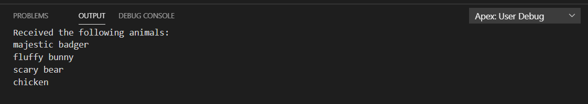
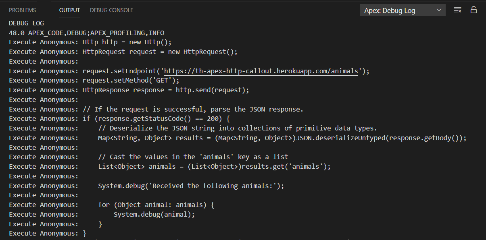
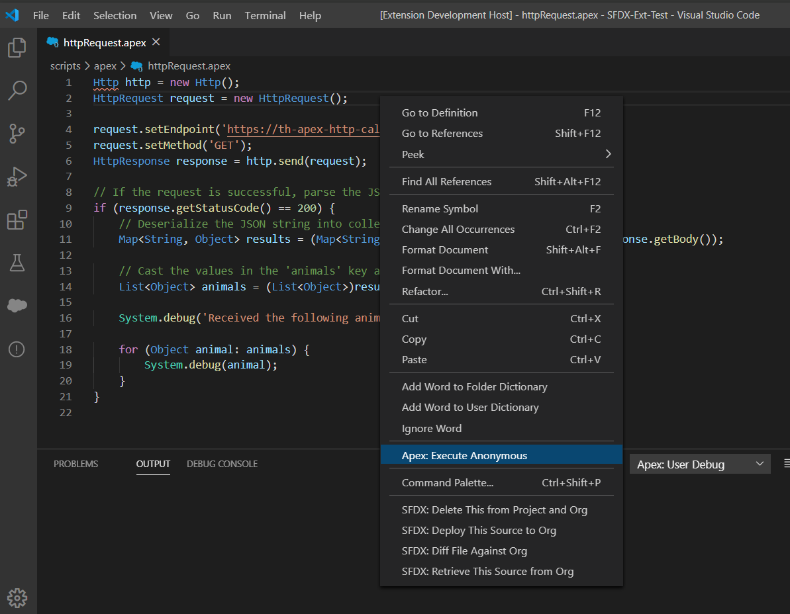
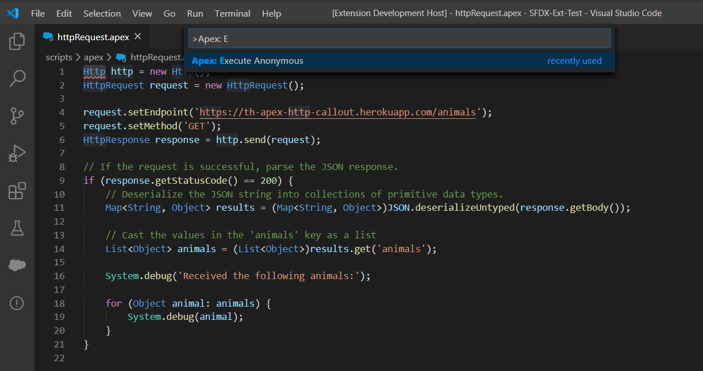

# Apex Code Runner

Apex Code Runner is a simple, fast and graceful tool for running `Apex` scripts within VS Code. This extension executes simple scripts and returns results significantly faster than the Salesforce Extensions Pack.

> __NOTES:__
>
> - The [Salesforce CLI Integration](https://marketplace.visualstudio.com/items?itemName=salesforce.salesforcedx-vscode-core) extension included in the [Salesforce Extension Pack](https://marketplace.visualstudio.com/items?itemName=salesforce.salesforcedx-vscode) is required to run Apex Code Runner
> - Context menus will only work with files that have a `.apex` or `.soql` extension
> - The VS Code workspace MUST be a valid Salesforce project with an authenticated user

## Features

- Executes Apex code
- Returns __CLEAN__ `System.debug` responses
- Returns full debug log in a secondary output
- Output panels refresh with each execution. _No more scrolling of repetitive output_

### Clean User Debug Without the Clutter of a Full Debug Log

Speeds up development by showing only what you want.

### Full Debug Log Too

### Context Menu Where You Need It

### Command Palette Menu When Needed

## Requirements

The [Salesforce CLI Integration](https://marketplace.visualstudio.com/items?itemName=salesforce.salesforcedx-vscode-core) extension included in the [Salesforce Extension Pack](https://marketplace.visualstudio.com/items?itemName=salesforce.salesforcedx-vscode) is required to run this extension.

## Extension Settings

This extension contributes the following settings:

- `apex-code-runner.logCategoryOptions`: Apex log categories with their associated log levels. These only affect the level of detail in the full log output window.
  - `Apex_code`: Debug
  - `Apex_profiling`: Info
  - `Callout`: Info
  - `Db`: Info
  - `System`: Debug
  - `Validation`: Info
  - `VisualForce`: Info
  - `Workflow`: Info
- `apex-code-runner.preferredWindow`: Output window to display when execution completes. You can view either at any time.
  - `userDebug`: (Default) Shows only system.debug statements (and errors)
  - `fullLog`: Shows the Full log will show the full log

## Known Issues

N/A

## Inspirational Projects

Here are some of the projects that were the primary inspiration and templates for this project

- [Salesforce Extensions for VS Code](https://github.com/forcedotcom/salesforcedx-vscode)
- [ForceCode for Visual Studio Code](https://github.com/celador/ForceCode)
- [SalesforceDX Code Companion](https://github.com/msrivastav13/DX-Code-Companion)
- [@salesforce/core](https://github.com/forcedotcom/sfdx-core)

## Release Notes

See the [CHANGELOG.md](./CHANGELOG.md) for current release notes and changes

__Enjoy!__
